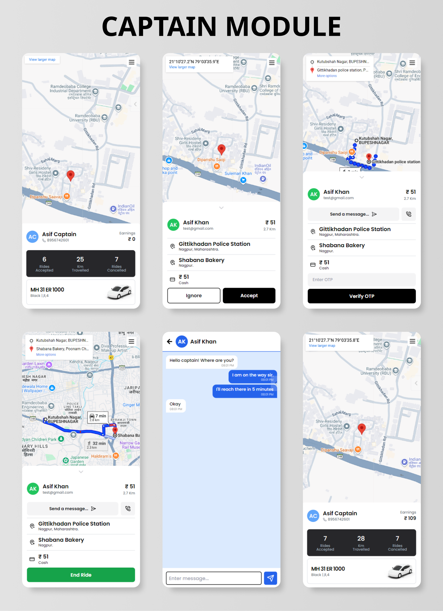

    

# Cab Booking System - Full Stack Ride Booking Application

This is a full-stack ride booking application developed using modern web technologies. The project replicates core features of real-world ride booking platforms, including **user authentication**, **ride booking**, **real-time tracking**, **fare calculation**, and **real-time communication**.

The system is designed with a clean and responsive user interface, focusing on usability and performance. This project demonstrates practical implementation of **frontend and backend development, API integration, and real-time systems**.

---

## 📚 Table of Contents

1. [Tech Stack](#tech-stack)
2. [Features](#features)
3. [Screenshots](#screenshots)
4. [Quick Start](#quick-start)
5. [Environment Variables](#environment-variables)
6. [License](#license)

---

## ⚙️ Tech Stack

  

| **Category**       | **Technologies / Tools**                                              |
| ------------------ | --------------------------------------------------------------------- |
| **Frontend**       | HTML, CSS, React.js, Tailwind CSS, Google Maps                        |
| **Backend**        | Node.js, Express.js, MongoDB, Socket IO, NodeMailer, Google Maps APIs |
| **Authentication** | JWT (JSON Web Token), bcrypt                                          |
| **Deployment**     | Vercel, Render                                                        |
| **Dev Tools**      | Postman, npm, Nodemon, ESLint                                         |

---

## ✨ Features

### 🔐 Authentication & Authorization

- Secure login with validation
- Email verification and logout functionality
- Forgot and change password support
- Role-based access control (User and Driver)
- Protected routes and session handling

### 🧑🏻 User Management

- Profile management (name, email, phone)
- Ride history tracking
- Form validation for inputs

### 📍 Location & Mapping

- Pickup & destination auto-complete
- Real-time location tracking
- Route visualization with distance and ETA

### 🚖 Ride Booking System

- Multiple ride options: Car, Bike, Auto
- Ride status tracking: Pending → Completed
- Single-driver acceptance system
- Auto-cancellation for inactive requests
- Dynamic fare calculation

### 🔄 Real-Time Features

- Live ride updates using sockets
- Real-time chat between user and driver
- Message storage with timestamps
- Access control for chat visibility

### 👨‍✈️ Driver Interface

- Accept/reject ride requests
- Live trip updates
- Role-based functionality

### 🧰 Utilities

- Logging system for debugging
- Reset feature for app recovery
- Notification system for user feedback

---

## 🖼️ Screenshots

Authentication

Sidebar Navigation

User Module

Driver Module

---

## ⚡ Quick Start

### 📁 Project Structure
